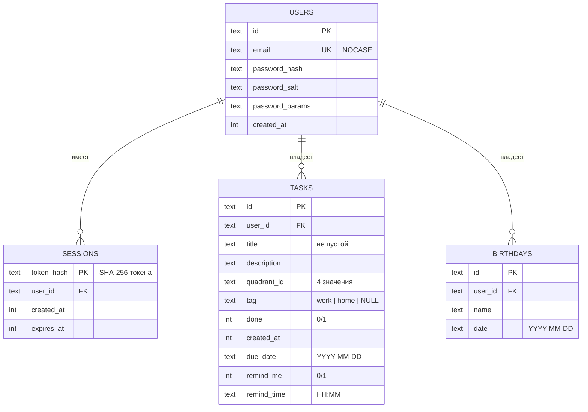
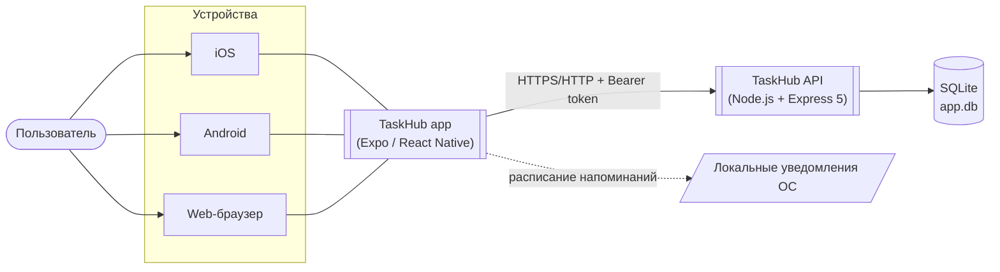
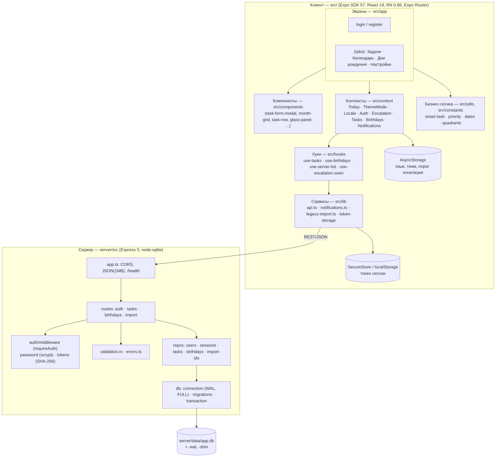
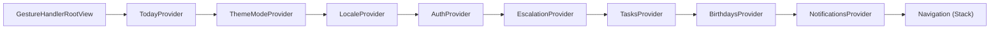
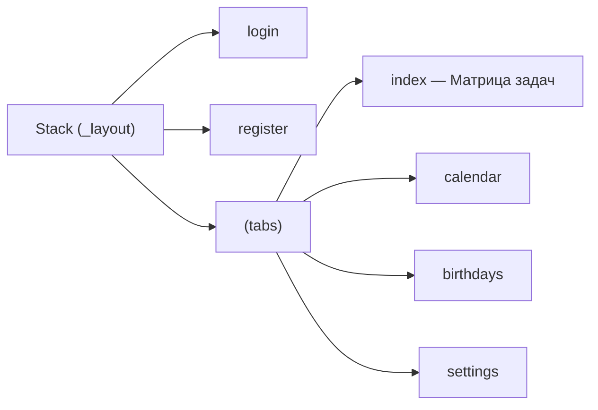
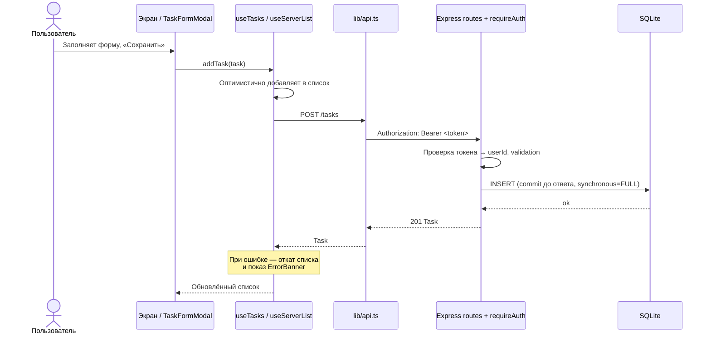

# TaskHub — обзор проекта (Business Analysis Document)

| | |
|---|---|
| **Продукт** | TaskHub (репозиторий `todo-mobile`) |
| **Тип** | Кроссплатформенное приложение: iOS, Android, Web + собственный API-сервер |
| **Версия** | 1.0.0 |
| **Статус документа** | Актуально на 2026-10-04 (состояние ветки `main` + незакоммиченные изменения) |
| **Владелец** | tatianas |

> Документ ведётся вместе с кодом. При изменении функциональности, API или архитектуры обновляйте
> соответствующий раздел и строку в [Истории изменений](#13-история-изменений).

---

## 1. Назначение и бизнес-цель

TaskHub — персональный менеджер задач на основе **матрицы Эйзенхауэра** (срочно/важно) с календарём,
днями рождения и напоминаниями. Аккаунт хранится на собственном сервере, поэтому один и тот же
пользователь видит свои данные с любого устройства.

**Проблема:** обычные to-do списки не помогают расставлять приоритеты и перегружают пользователя задачами.

**Решение:** задачи сразу раскладываются по 4 квадрантам; в каждом квадранте действует мягкий лимит
активных задач; приближающийся дедлайн автоматически «поднимает» задачу в срочный квадрант.

### Целевая аудитория
Частные пользователи, которым нужен простой инструмент личного планирования (работа/дом) на русском и
ещё 6 языках.

---

## 2. Границы системы (Scope)

**В рамках проекта (есть сейчас)**
- Регистрация / вход по email + паролю, сессии на сервере.
- Задачи в матрице Эйзенхауэра, теги, дедлайны, напоминания.
- Календарь (месяц) с задачами и днями рождения.
- Дни рождения и уведомления о них.
- Настройки: язык, 4 темы, авто-эскалация по дедлайну, уведомления.
- Импорт старых локальных данных в аккаунт.
- 7 языков интерфейса.

**Вне рамок (сейчас нет)**
- Совместная работа / общие задачи.
- Push-уведомления с сервера (только локальные).
- Восстановление пароля, подтверждение email.
- Офлайн-режим с синхронизацией (данные только на сервере).
- Виджеты iOS — были реализованы (Today / Now / Matrix), но **удалены в рабочей копии** (см. [Открытые вопросы](#12-риски-ограничения-и-открытые-вопросы)).

---

## 3. Роли и заинтересованные стороны

| Роль | Описание |
|---|---|
| Пользователь | Единственная роль продукта. Видит только свои данные (все запросы на сервере фильтруются по `user_id`). |
| Разработчик / владелец | Разворачивает сервер, собирает приложение через EAS. |

---

## 4. Функциональные требования (что реализовано)

### 4.1 Аккаунт и сессия
| ID | Функция | Детали |
|---|---|---|
| F-01 | Регистрация | Email (уникален без учёта регистра) + пароль, минимум 8 символов. Экран `register`. |
| F-02 | Вход | Email + пароль, возвращается bearer-токен. Экран `login`. |
| F-03 | Выход | Сессия удаляется на сервере. |
| F-04 | Хранение токена | Нативно — `expo-secure-store`, web — `localStorage`. |
| F-05 | Авто-выход | При ответе 401 `UNAUTHORIZED`/`SESSION_EXPIRED` приложение разлогинивает пользователя. |

### 4.2 Задачи (вкладка «Задачи»)
| ID | Функция | Детали |
|---|---|---|
| F-10 | Матрица 4 квадрантов | 🔥 срочно+важно · 📅 не срочно+важно · ⚡ срочно+не важно · 📥 не срочно+не важно |
| F-11 | CRUD задачи | Название, описание, квадрант, тег (`work`/`home`/нет), выполнено, дедлайн. |
| F-12 | Лимит квадранта | Не более 3 активных задач в квадранте — далее предлагается «Swap to Add» (`MAX_ACTIVE_TASKS_PER_QUADRANT`). |
| F-13 | Умный ввод | Из текста извлекается дата (`chrono-node`, 7 языков) и предлагается важность по ключевым словам. |
| F-14 | Авто-эскалация | Если до дедлайна ≤ N дней, «не срочная» задача показывается в «срочном» квадранте (хранимый квадрант не меняется; эффект самоотменяется). Отмечается 🔥 и баннером. |
| F-15 | Напоминание | Флаг `remindMe` + время `remindTime` → локальное уведомление. |
| F-16 | Оптимистичные обновления | UI меняется сразу, при ошибке — откат. Pull-to-refresh и обновление при возврате в приложение. |

### 4.3 Календарь
| ID | Функция |
|---|---|
| F-20 | Месячная сетка с задачами по датам и днями рождения. |
| F-21 | Список выбранного дня; быстрое добавление задачи на день. |
| F-22 | Группы «Сегодня», «Завтра», «Без даты». |

### 4.4 Дни рождения
| ID | Функция |
|---|---|
| F-30 | Добавление / удаление (имя + дата). |
| F-31 | Отображение «Сегодня!» / «через N дн.». |
| F-32 | Локальное уведомление в 09:00 в день рождения (перепланируется на следующий год). |

### 4.5 Настройки
| ID | Функция |
|---|---|
| F-40 | Тема: Dark (Aurora), Light (Warm), Coral, Midnight Emerald (стиль «Aurora Glass»). |
| F-41 | Язык: ru, en, es, fr, de, pt, zh. |
| F-42 | Порог авто-эскалации: выкл / N дней / своё значение. |
| F-43 | Разрешение на уведомления и подсказка при отказе. |
| F-44 | Выход из аккаунта. |

### 4.6 Уведомления
Только **локальные** (`expo-notifications`). Пересоздаются при каждом изменении данных и при запуске.
Лимит — 60 запланированных (ограничение iOS — 64). Web не поддерживается.

### 4.7 Импорт старых данных
Если на устройстве остались данные старой версии (AsyncStorage), после входа предлагается
разовый импорт в аккаунт. Операция атомарна (одна транзакция) и идемпотентна (повторный импорт не создаёт дублей).

---

## 5. Нефункциональные требования

| Область | Реализация |
|---|---|
| Безопасность | Пароли — scrypt; в БД хранится только SHA-256 хэш токена сессии; изоляция данных по `user_id`; чужая/несуществующая запись → одинаковый 404. |
| Надёжность | SQLite в режиме WAL с `synchronous=FULL`: каждая запись фиксируется до ответа клиенту; потеря данных при падении/`kill -9` исключена. |
| Эволюция схемы | Версионные миграции через `PRAGMA user_version`, append-only, каждая в своей транзакции. |
| Производительность клиента | Таймаут запроса 10 с, React Compiler включён. |
| Локализация | 7 языков, плюрализация (`i18n/plural.ts`). |
| Тестируемость | 12 файлов тестов сервера на `node:test` (auth, tasks, birthdays, import, БД, durability, config, валидация и др.). |
| Переносимость | Web-варианты компонентов (`*.web.tsx`) для даты/времени/хранилища токена. |

---

## 6. Модель данных



Все дочерние таблицы удаляются каскадно (`ON DELETE CASCADE`).

---

## 7. Архитектура

### 7.1 Контекстная диаграмма (C4 — уровень 1)



### 7.2 Контейнеры и слои



### 7.3 Иерархия провайдеров приложения

Порядок в `src/app/_layout.tsx` (внешний → внутренний):



### 7.4 Навигация



### 7.5 Ключевой сценарий: создание задачи (оптимистичное обновление)



---

## 8. API (контракт)

База: `EXPO_PUBLIC_API_URL`. Формат ошибки: `{ "error": "CODE" }`; клиент показывает `t('errors.CODE')`.

| Метод | Путь | Авторизация | Назначение | Успех |
|---|---|:-:|---|---|
| GET | `/health` | — | Проверка живости, `{ ok }` | 200 |
| POST | `/auth/register` | — | Создать аккаунт (пароль ≥ 8) | 201 + токен |
| POST | `/auth/login` | — | Войти | 200 + токен |
| GET | `/auth/me` | ✔ | Текущий пользователь | 200 |
| POST | `/auth/logout` | ✔ | Завершить сессию | 204 |
| GET | `/tasks` | ✔ | Список задач пользователя | 200 |
| POST | `/tasks` | ✔ | Создать (id задаёт клиент; дубликат → 409 `DUPLICATE_ID`) | 201 |
| PUT | `/tasks/:id` | ✔ | Изменить поля | 200 |
| DELETE | `/tasks/:id` | ✔ | Удалить | 204 |
| GET | `/birthdays` | ✔ | Список | 200 |
| POST | `/birthdays` | ✔ | Создать | 201 |
| DELETE | `/birthdays/:id` | ✔ | Удалить | 204 |
| POST | `/import` | ✔ | Разовый импорт `{tasks, birthdays}` → `{tasksImported, birthdaysImported}` | 200 |

Типовые коды ошибок: `UNAUTHORIZED`, `SESSION_EXPIRED`, `WRONG_PASSWORD`, `PASSWORD_TOO_SHORT`,
`NOT_FOUND`, `DUPLICATE_ID`, `INVALID_TASK`, `INVALID_BIRTHDAY`, `SERVER_UNREACHABLE` (клиентский).

---

## 9. Технологический стек

| Слой | Технологии |
|---|---|
| Клиент | Expo SDK 57, React 19.2, React Native 0.86, Expo Router (typed routes), React Compiler, TypeScript 6 |
| UI/UX | expo-glass-effect, expo-blur, expo-linear-gradient, reanimated 4, gesture-handler, @expo/ui |
| Устройство | expo-notifications, expo-secure-store, AsyncStorage, datetimepicker |
| Логика | chrono-node (разбор дат), собственная i18n (7 языков) |
| Сервер | Node.js ≥ 22.13, Express 5, `node:sqlite`, cors, tsx |
| Сборка/доставка | EAS (`eas.json`: development / preview / production) |
| Качество | ESLint (eslint-config-expo), `node:test` на сервере |

---

## 10. Структура репозитория

```
todo-mobile/
├── src/                  # Клиент (Expo)
│   ├── app/              #   экраны и роутинг (login, register, (tabs)/*)
│   ├── components/       #   UI-компоненты (+ *.web.tsx варианты)
│   ├── context/          #   глобальное состояние (8 провайдеров)
│   ├── hooks/            #   data-хуки
│   ├── lib/              #   api, notifications, legacy-import, token-storage
│   ├── i18n/             #   переводы (ru, en, es, fr, de, pt, zh), плюрализация
│   ├── constants/        #   quadrants, tags, theme (4 темы)
│   ├── types/            #   Task, Birthday
│   └── utils/            #   dates, priority, smart-task, colors
├── server/               # API (отдельный npm-пакет)
│   ├── src/              #   app, routes, repos, auth, db, validation, errors
│   ├── test/             #   тесты (node:test)
│   └── data/             #   app.db (не коммитится)
├── specs/sqlite-migration/  # Spec: requirements → design → tasks
├── docs/                 # Документация (этот файл)
├── assets/               # Иконки, сплэш
├── app.json, eas.json    # Конфиг Expo / EAS
└── .env.example          # EXPO_PUBLIC_API_URL
```

---

## 11. Запуск и конфигурация

```bash
npm install && npm --prefix server install
cp .env.example .env            # EXPO_PUBLIC_API_URL
npm run server                  # API на :4000
npm run ios | android | web     # клиент
npm run server:test             # тесты сервера
```

| Переменная | Где | По умолчанию | Смысл |
|---|---|---|---|
| `EXPO_PUBLIC_API_URL` | `.env` | — (обязательна) | Адрес API: simulator/web `http://localhost:4000`, Android emulator `http://10.0.2.2:4000`, устройство — LAN IP |
| `PORT` | `server/.env` | 4000 | Порт API |
| `DB_PATH` | `server/.env` | `./data/app.db` | Файл SQLite |
| `CORS_ORIGIN` | `server/.env` | `http://localhost:8081` | Разрешённые origin (через запятую) |

Идентификаторы приложения: `com.tatsianas.todomobile` (iOS и Android), схема ссылок `todomobile`.

---

## 12. Риски, ограничения и открытые вопросы

| # | Пункт | Комментарий |
|---|---|---|
| 1 | **Виджеты удалены в рабочей копии** | `src/widgets/*`, `use-widget-sync.ts` помечены удалёнными, `expo-widgets` убран из `package.json`/`app.json`. Подтвердить: это окончательное решение или временный откат (коммиты `e9fe3e4`, `5bfa2ff` содержат реализацию). |
| 2 | Нет восстановления пароля / верификации email | Потеря пароля = потеря доступа. |
| 3 | Нет офлайн-режима | Без связи с сервером приложение недоступно (`SERVER_UNREACHABLE`). |
| 4 | Сервер без HTTPS «из коробки» | Для публичного развёртывания нужен reverse-proxy с TLS. |
| 5 | Нет rate-limit на `/auth/*` | Риск перебора паролей при публичном доступе. |
| 6 | Резервное копирование БД вручную | Рекомендуется `sqlite3 .backup` (WAL-режим). |
| 7 | Нет CI | Тесты и lint запускаются локально. Нет клиентских тестов. |
| 8 | Лимит 60 локальных уведомлений | Ближайшие по времени имеют приоритет. |
| 9 | `submit.production` в `eas.json` пуст | Для публикации в сторы нужны данные аккаунтов. |

---

## 13. История изменений

| Дата | Изменение |
|---|---|
| 2026-10-04 | Первая версия документа: описание системы, архитектура, API, модель данных. |

### Связанные документы
- [README.md](../README.md) — быстрый старт и архитектурная заметка.
- [specs/sqlite-migration/](../specs/sqlite-migration/README.md) — спецификация перехода на SQLite-сервер (requirements / design / tasks).
- [AGENTS.md](../AGENTS.md) — правила для AI-агентов (использовать актуальную документацию Expo v57).
